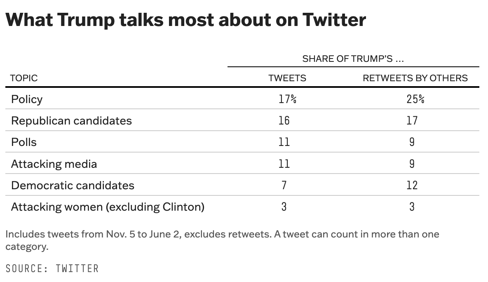
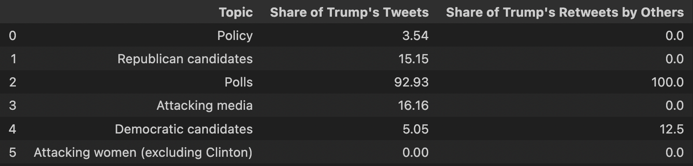
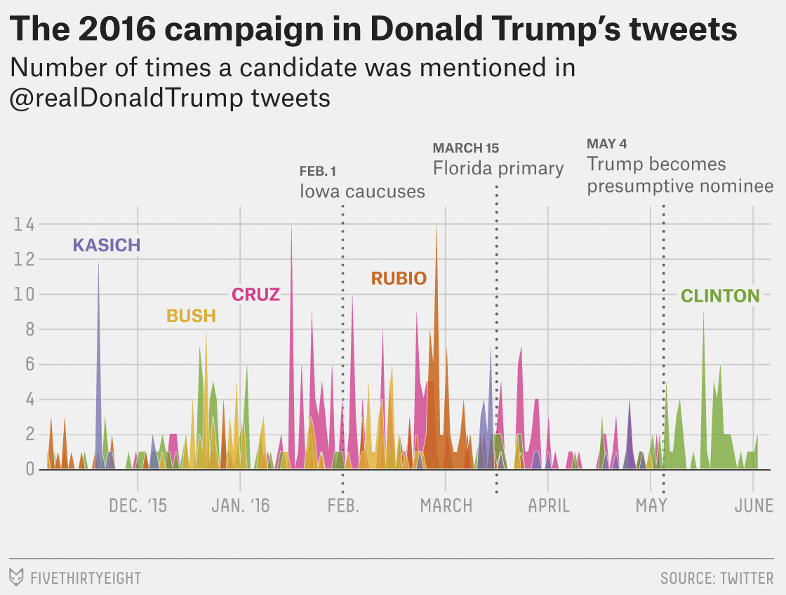
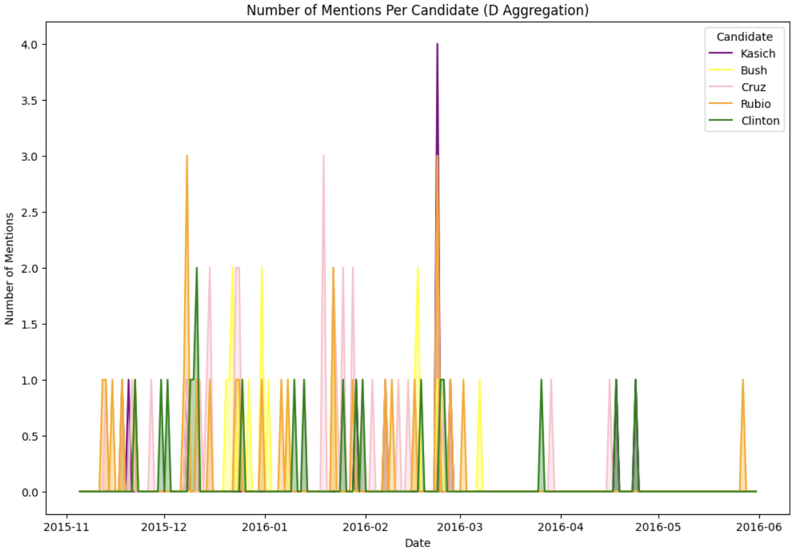
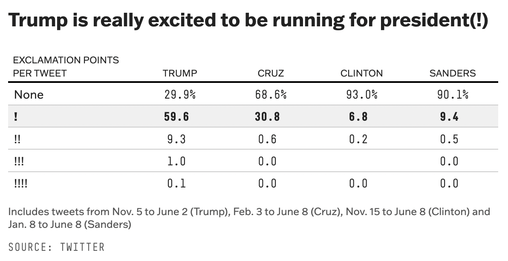
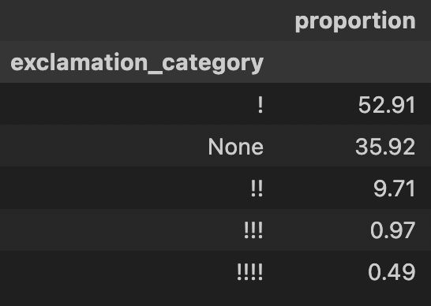

# Reproducing FiveThirtyEight's "The World’s Favorite Donald Trump Tweets" Analysis

Original Article: https://fivethirtyeight.com/features/the-worlds-favorite-donald-trump-tweets/
Original Data: https://github.com/fivethirtyeight/data/blob/master/trump-twitter/realDonaldTrump_poll_tweets.csv

## Project Overview

In 2016, FiveThirtyEight's Leah Libresco conducted an analysis of trends in Donald Trump's tweets during part of the 2016 elections. The key parts of the methodology they described are

- 'We downloaded and categorized more than 3,000 of his most recent tweets (from Nov. 5 through June 2). All statistics on the total number of favorites and retweets were current as of June 2.'
- 'Tweets were individually categorized by hand according to their content; categories covered a range of topics from specific people attacked (Elizabeth Warren, the pope), specific policy areas addressed (foreign policy, jobs policy) and tweets about Trump’s own controversies (Trump University, his tax returns). A tweet could fit more than one category. Our analysis did not specifically tally tweets announcing media or speaking appearances; those would fall under “other.” '
- 'Our analysis includes only tweets that were entirely by Trump (so it excludes the times Trump retweeted someone else’s tweet, which made up a little less than a third of the tweets we collected).'

Based on this, they published 3 bodies of analysis

- A table titled "What Trump talks most about on Twitter" with rows for each of the following categories containing the percent of Trump's tweets and "retweets by others" separately
  - Policy
  - Republican candidates
  - Polls
  - Attacking media
  - Democratic candidates
  - Attacking women (excluding Clinton)
- A graph titled "The 2016 campaign in Donald Trump's tweets – Number of times a candidate was mentioned in @realDonaldTrump tweets" which was a line graph for frequency of mention of each of the following graphs in his tweets over the time period
  - Kasich
  - Bush
  - Cruz
  - Rubio
  - Clinton
- A table titled "Trump is really excited to be running for president(!)" comparing the distribution of the number of exclamation point in Trump's tweets with those of the following additional candidates
  - Cruz
  - Clinton
  - Sanders

I thought it would be interesting to use OpenAI's API to categorize the tweets from this analysis and see how closely this LLM-based methodology that would probably be used to do this analysis today is able to match + reproduce these results. In the process of doing this, I noticed some key issues and ambiguities in FiveThirtyEight's documented methodology that made it difficult to consistently reproduce this analysis.

1. While they describe the data corpus as "more than 3,000 of his most recent tweets (from Nov. 5 through June 2)," the data they provide contains only 449 tweets, of which 206 are within that date range (8 of those are retweets) and 43 of all of the tweets in the dataset are retweets (about 10% of tweets, though they claim his retweets "made up a little less than a third of the tweets we collected")
2. It is unclear whether the "RETWEETS BY OTHERS" column in the "What Trump talks most about on Twitter" table refers to Trump's retweets of other people's posts, 43 of which are contained within the data they published, or the retweets other people did of Trump's posts, which are not contained within the provided dataset. In attempt to reproduce this analysis given the limited data provided, I assumed the former, though based on the results and the wording of the column title, I believe the latter is more likely to have been used in the original analysis.
3. Moreover, since the data provided only contain's 449 of Trump's tweets, it was impossible to reproduce the "Trump is really excited to be running for president(!)" table in full, which measures exclamation point count distribution in Cruz, Clinton, and Sanders' tweets as well.
4. The actual strategy of manual topic categorization is poorly specified.
   a. It isn't clear what the full set of categories is since some are mentioned in the text (Elizabeth Warren, the pope,foreign policy, jobs policy,Trump University, his tax returns) but are not included in any of the tables or graphs produced.
   b. There is some room for subjectivity in making these categorizations since some tweets discuss things like him winning, without specifying specific polls, but could potentially still be reactions to recent polls – specifics on the categorization procedure and context of the time would have be important in clearing up these ambiguities.
   c. They did not publish the post-categorized data, making it difficult to reproduce their exact analysis and uncover the answers to the previously described ambiguities.

## Reproduction Instructions

### Option 1: Run the full code including OpenAI API processing

_This requires an OpenAI API key which can be obtained through following these steps https://platform.openai.com/docs/quickstart_

Once you have the OpenAI key, set it as an env variable (e.g. in an .env file):

```
OPENAI_API_KEY=""
```

### Option 2: Use the provided gpt_processed_tweets.csv data to run all of the code following the OpenAI API processing

Start from the cell commented as _Start here for Option 2_ in main

### Environment Setup

The simplest way to run my code is to set up a virtual environment where you can install the necessary packages (namely openai):

```
python3 -m venv venv
```

To activate the virtual environment:

```
. /venv/bin/activate
source ./venv/bin/activate
```

To install the necessary packages:

```
pip install openai
pip install pandas
```

## Reproduction Results & Analysis

### Procedure

1. Except for in attempting to recreate the retweet column of the "What Trump talks most about on Twitter" table, I preformed the entirity of the analysis on the subset of the total 449 Donald Trump tweets in the provided dataset that are within the date range of Nov. 5 2015 through June 2 2016, inclusive that are not retweets of other people's posts. This is a notably smaller dataset than the "more than 3,000" described by FiveThirtyEight's analysis, and is likely the source of discrepencies with their results.

2. I applied GPT-4o-mini model to make the tweet categorizations based on the following prompt (following iterations of prompt engineering and testing):

"List the subset of categories (Policy, Republican candidates, Polls, Attacking media, Democratic candidates, Attacking women excluding Clinton) that this tweet falls into, followed by the subset of candidates (Kasich, Bush, Cruz, Rubio, Clinton) that this tweet mentions. A tweet could fit more than one category and/or mention more than one candidate. Please format as a singular list separated by commas. Example: Policy, Polls, Kasich, Rubio. If none fit, leave it blank. Only include categories that directly capture the tweet's content i.e. what a human labeller would conclude. Keep in mind that Kasich, Bush, Cruz, and Rubio were republican candidates and Clinton was a democratic candidate. Tweet: {tweet}"

Based on manually inspecting close to 100 of the categorizations GPT made for the tweets, I feel confident that it performed fairly closely to how a human would categorize the tweets.

3. I filtered the data by date and non-retweets and reproduced the tables and figures to the best of my abilities.

### Results

The results differ quite substantially from the original analysis, however, it seems to be due to the lack of access to their full data set, not a specific methodological issue in the reproduction – the use of GPT to do the categorization does not seem like the primary driver of the discrepencies in results.

#### 'What Trump talks most about on Twitter' Table





Here we see that the percetages of topic mentions differ substantially between the analyses, likely because a. the dataset that was published and thus used in the reproduction is substantially smaller than the dataset that was claimed to use in the orignal analysis and b. the dataset also didn't include retweets other people made of Trump's posts – I instead used Trump's retweets of other's posts to recreate the column which was likely not what was done in the original analysis.

#### 'The 2016 campaign in Donald Trump's tweets – Number of times a candidate was mentioned in @realDonaldTrump tweets' Graph





Similarly, here the graphs differ between the analyses, but based on a non-rigorous spot check, it seems as though the graph I produced is a rough subset of the graph in the original analysis, based on way fewer tweets (max frequncy per candidate per day is 4 in the reproduction but 14 in the original analysis). This supports the general conclusion that the discrepencies between the reproduction and original analysis are largely tied to the limited subset of data I had to work with, as opposed to severe methodological issues.

#### 'Trump is really excited to be running for president(!)' Table





While I was only able to recreate one column from this table due to the lack of data provided on the tweets of the other candidates being compared to Trump, here the numbers seem to generally match those of the original analysis, further supporting the conclusion that a primary driver of discrepencies in this analysis is the dataset completion.

### Conclusions

Overall, this analysis shows that LLMs can serve as a useful tool to efficiently reproduce analyses that were once too tedious and time intensive to evaluate. Dataset completeness quickly emerged as a major problem in reproducing the results of the chosen analysis, highlighting the need achieve reproducability by not not just providing data, but rigorously checking that the full data is provided, with no ambiguities in provenance, processing, and analysis.
